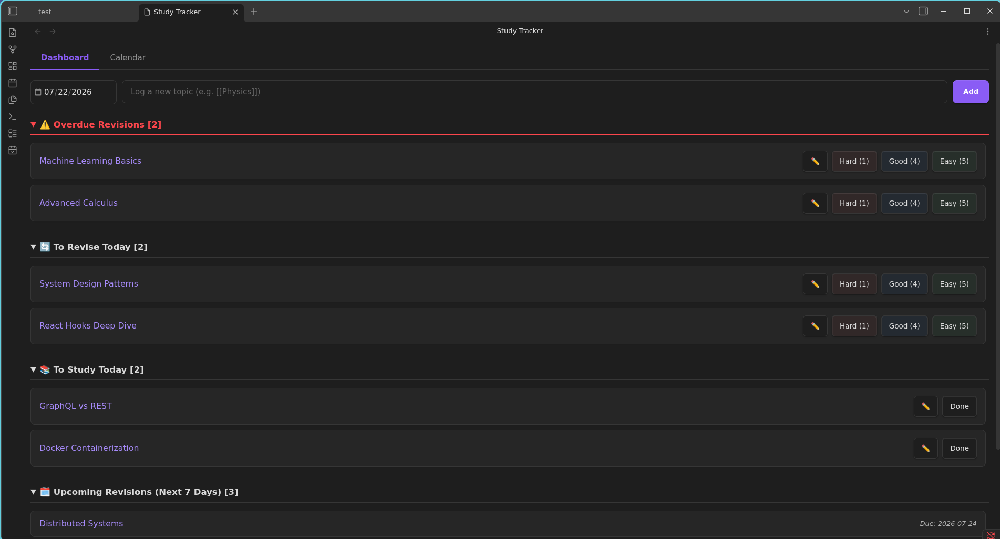

# Study & Revision Planner (Spaced Repetition)

A hybrid study planner and spaced repetition plugin for Obsidian! Keep track of your studies directly within your favorite markdown editor and never forget what you've learned. 

This plugin seamlessly combines a visual **Study Tracker Calendar** with powerful **Spaced Repetition** algorithms. Log what you've studied, schedule it, and let the plugin automatically calculate the perfect date for your next review!

## Features

### 🧠 Dual Spaced Repetition Algorithms
Choose the study schedule that works best for you in the plugin settings:
* **SM-2 (Dynamic):** The gold-standard algorithm used by Anki. It dynamically adapts to your memory. If you find a topic easy, it pushes the review further into the future. If you struggle, it brings it closer.
* **Static Schedule:** Prefer a predictable schedule? Define your own custom interval sequence (e.g., `1, 7, 15, 30` days). You progress to the next step only if you score well on your review.

### 🗓️ Visual Calendar Tracker
* View all your scheduled, upcoming, and overdue revisions at a glance on a dedicated calendar view.
* Click any day to quickly log a new topic.
* Drag and drop topics to manually reschedule them.

### 📱 Fully Responsive
Designed to look gorgeous on both desktop and mobile devices. A sticky action bar ensures you can add topics on your phone with zero hassle!

### 🔄 Live Sync Support
Automatically syncs and re-renders if you use Obsidian Sync or third-party cloud syncing to edit your data from another device!

---

## How to Use

### Launching the Tracker
To launch the planner, look for the **calendar-check icon** (📅) located in the left-hand ribbon menu of your Obsidian workspace. Clicking this icon will open the Study Tracker view.

### Workflow
1. In the **Dashboard** tab, type the name of the topic you want to study (e.g., `[[Quantum Physics]]` to link to your note) and click Add.
3. Once you've completed your initial study session, click **Done**. The topic will be scheduled for its first revision.
4. When the revision is due, it will appear in the **To Revise Today** section. Grade your memory (Hard, Good, or Easy), and the plugin will automatically calculate and schedule the next interval!

## Installation

### Manual Installation (Until available on Community Plugins)
1. Download the latest release (`main.js`, `manifest.json`, `styles.css`) from the GitHub Releases page.
2. Extract the files into your vault's plugins folder: `<vault>/.obsidian/plugins/study-revision-planner-spaced-repetition/`.
3. Reload Obsidian and enable the plugin in Settings > Community Plugins.

## Settings
Go to **Settings > Spaced Repetition Settings** to toggle between **SM-2** and **STATIC** algorithms. If using **STATIC**, you can specify a comma-separated list of intervals in days (e.g., `1, 7, 15, 30`).
